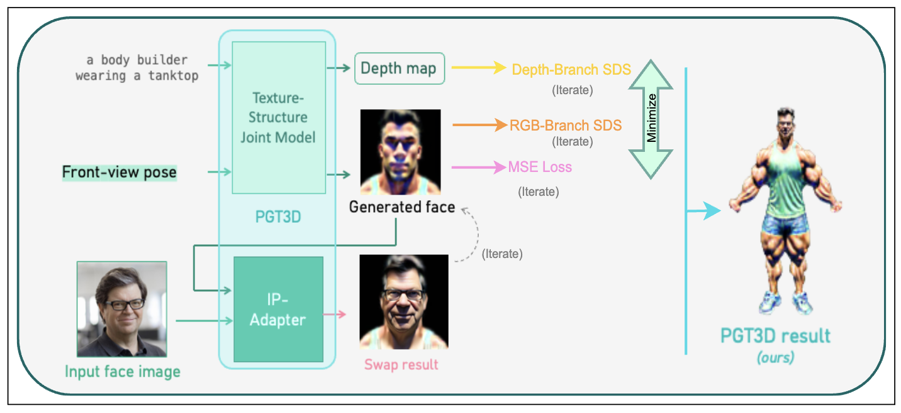

# CV803 - PGT3D: Personalized Personalized Generation for Text-to-3D Human

Project for the CV803 - Advanced CV course - April 2024.
<br>
<br>
[Yanan Wang](Yanan.Wang@mbzuai.ac.ae), [Sara Ghaboura](Sara.Ghaboura@mbzuai.ac.ae), [Tingting Liao](Tingting.liao@mbzuai.ac.ae)
<br>
<br>
[[Paper]()]   [[Demo]()]    [[Survey](https://docs.google.com/forms/d/e/1FAIpQLScbd-G0GG0UbHELhb9gQx7S8L_JnYxyV-X57M5DSXbMwN_-ww/viewform?vc=0&c=0&w=1&flr=0)]     

___________________________________________
 <em> The surge in virtual and augmented reality over the last decade has catalyzed a growing interest in 3D object generation. Recent years have unveiled visual-language models adept at crafting 3D objects from textual descriptions. Yet, these existing approaches falter in creating high-fidelity, human-like avatars, especially in replicating the subtleties of facial details and expressions. The introduction of 3D Gaussian splatting (3DGS) made strides in rendering character limbs but did not achieve the desired level of facial realism. We present the Personalized Generation for Text-to-3D Human (PGT3D) model to surmount these challenges. This approach merges textual prompts, specific poses, and guiding facial images to forge personalized, lifelike 3D avatars, viewable from multiple perspectives and surpassing current models' facial accuracy and expression. Our evaluations reveal that PGT3D excels beyond state-of-the-art models in depicting intricate facial features, marking a pivotal progression towards crafting expressive human avatars from text and portraits and elevating realism in digital realms.   </em> 


## PGT3D Framework:
<p align="center">
   
   <be>
   <h6> <em> Figure 1. PGT3D Pipeline. In the first stage: the Texture-Structure joint model accepts a textual prompt and the required avatar pose, and it generates the depth map and initial character face. Then,
the IP-Adapter takes the face output of the previous stage with a specific portrait as an image prompt and generates the personalized avatar.</em> </h6>
</p>


## Description 

<p align="center">
   
   <be>
   <h6> <em> Figure 2. Here. </em> </h6>
</p>


## Our Contributions
We can summarize our contributions as follows:
  - Introducing a novel approach capable of generating personalized, human-like avatars conditioned by a single prompt and portrait photograph.
  - Crafting personalized characters of high quality, infused with fine-grained details.
  - Establishing new benchmarks in the realm of digital human generation.
## News
[2024-04-16] Code is available!
<br>
[2024-03-31] Initiating the repository, and uploading the project proposed pipeline. 

## To Install the environment
```diff
# git clone this repository
git clone github.com/Yanan-Wang-cs/HumanGaussian_CV803
cd HumanGaussian_CV803

# create new anaconda env
conda env create -f humangaussian.yaml
conda activate humangaussian


# install python dependencies
pip3 install -r requirements.txt
```


### Quick Inferences
- In case any library requires compilation and the humangaussian.yaml file doesn't function properly, please refer to the following links for guidance on installing the necessary environment:
    - [HumanGaussian](https://github.com/alvinliu0/HumanGaussian)
    - [IP-Adapter](https://github.com/tencent-ailab/IP-Adapter/tree/main)


- Download the library and model from following links and extract them under the folder HumanGaussian:
     - [IPAdapter](https://mbzuaiac-my.sharepoint.com/:u:/g/personal/yanan_wang_mbzuai_ac_ae/EcqJP9iV3TNOuMmik3LeIiABrZ3oc-jBxd2msETxWqVzPA?e=hKbtsH)
     - [Model](https://mbzuaiac-my.sharepoint.com/:u:/g/personal/yanan_wang_mbzuai_ac_ae/EZtICTpr2bFHiqNmyQjfrV8BhKfaHyd7kHZVJcIS7eFWxg?e=SxUZpz)
     - [Texture-Structure Joint](https://mbzuaiac-my.sharepoint.com/:u:/g/personal/yanan_wang_mbzuai_ac_ae/EfF79lcejKZCnVCJq_98MhYBzKdSEZSLo5SsRXo1mrXlVg?e=KjSOp2)


- Additionally, you can refer to our experiment results:
    - [CV803 1angle](https://mbzuaiac-my.sharepoint.com/:u:/g/personal/yanan_wang_mbzuai_ac_ae/EaLuT7l9vkBGjjZ9fD6PSDABLFB9xcLuXgTXUUee1aOM8w?e=98HT1I)


- In configs/test.yaml, you need to update:
    - exp_root_dir
    - smplx_path
    - model_key 


- Training the model:
```diff 
sh train.sh
```

## Visualization 
<p align="center">
   
   <br>
  <h6> <em> Figure 3. PGT3D results. 1st column) the textual prompt for the entire row. 2nd column) the Baseline HumnanGaussian (HG) result. 3rd column) Example 1 of the input image for avatar
personalization. 4th column) the PGT3D (ours) result. 5th column) Example 2 of the input image for avatar personalization. 6th column) the PGT3D (ours) result. Every row represents a different
textual prompt.</em></h6>
</p>

<p align="center">
   
   <be>
   <h6> <em> Figure 4. PGT3D results. 1st column) the textual prompt 1. 2nd column) the Baseline HumnanGaussian (HG) result. 3rd column) the input image for avatar personalization for textual prompts 1 and 2. 4th column) the PGT3D (ours) result. 5th column) the textual prompt 2. 6th column) the PGT3D (ours) result. 7th column) the Baseline HumnanGaussian (HG) result. </em> </h6>
</p>

## User Feedback results 
We conducted a detailed user study to evaluate the effectiveness of our approach, involving 60 participants of MBZUAI students, research assistants, and post-docs who assessed our results based on six key attributes: 1) Similarity, 2) Dissimilarity, 3) Personalized features, 4) Smoothness, 5) Complex details (glasses, hat/ hoodie/ messy hair, beard), and 6) Model success. The average of participants' votes favoring PGT3D are depicted in Figure 5. 
<p align="center">
   
   <be>
   <h6> <em> Figure 5. Average feedback (%) for favoring PGT3D transfer in terms of similarities and dissimilarities. </em> </h6>
</p>


  
## Acknowledgement
This project is based on 2 main models: 

```diff
HumanGaussian:
 @article{liu2023humangaussian,
    title={HumanGaussian: Text-Driven 3D Human Generation with Gaussian Splatting},
    author={Liu, Xian and Zhan, Xiaohang and Tang, Jiaxiang and Shan, Ying and Zeng, Gang and Lin, Dahua and Liu, Xihui and Liu, Ziwei},
    journal={arXiv preprint arXiv:2311.17061},
    year={2023}
}

IP-Adapter:
@article{ye2023ip,
  title={Ip-adapter: Text compatible image prompt adapter for text-to-image diffusion models},
  author={Ye, Hu and Zhang, Jun and Liu, Sibo and Han, Xiao and Yang, Wei},
  journal={arXiv preprint arXiv:2308.06721},
  year={2023}
}
